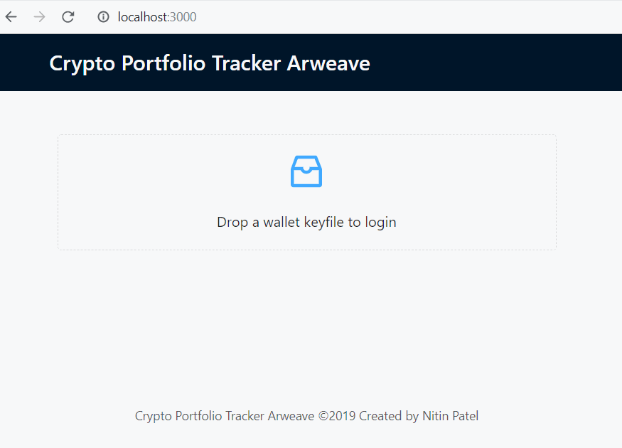

# crypto-portfolio-tracker-arweave

This is a (very very) basic version of a portfolio tracker that uses Arweave blockchain.

This application was made as a submission to this [Open Web Hackathon hosted on Gitcoin](https://gitcoin.co/issue/ArweaveTeam/Bounties/1/2929).

Deployed at: https://arweave.net/XMJFkwiFeGqC_BpwfOe0MuDX6CspekXvq-CdYi4LNc0

preview:

A lot can be improved upon from here. Right now it only shows the all the past transactions. Some features that can be added to make it really usable.

1. Display report of current portfolio instead of just past transactions.
2. Use API like coinmarketcap to display current prices of coins.
3. Implement some kind of pagination for fetching and displaying transactions.
4. Better UI/UX.

If you'd like you work on this project, feel free to make a PR. :)

## For developers:

This project was built using create-react-app. To run this project locally, clone this repo, run `npm install` and then `npm start`
